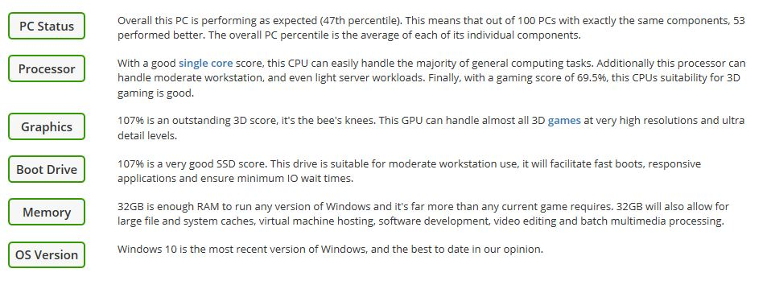

# Ultimate Gaming PC built - All you need Guide.
Specification of My Gaming/Work Station 

Bechmarked Using [UserBenchmark](https://www.userbenchmark.com)

## Benchmark Results

[UserBenchmarks: Game 95%, Desk 74%, Work 81%](https://www.userbenchmark.com/UserRun/18917192)  

||Model|Bench
:----|:----|:----|
**CPU**|[AMD Ryzen 7 2700](https://cpu.userbenchmark.com/AMD-Ryzen-7-2700/Rating/3957)|69.5%
**GPU**|[AMD RX Vega 56](https://gpu.userbenchmark.com/AMD-RX-Vega-56/Rating/3938)|107.1%
**SSD**|[WDC WDS500G2B0A 500GB](https://ssd.userbenchmark.com/SpeedTest/668277/WDC-WDS500G2B0A)|107.3%
**HDD**|[WD Blue 4TB (2015)](https://hdd.userbenchmark.com/WD-Blue-4TB-2015/Rating/3523)|100.7%
**RAM**|[G.SKILL Ripjaws 4 DDR4 3000 C15 4x8GB](https://ram.userbenchmark.com/SpeedTest/92734/GSKILL-F4-3000C15-8GRK-4x8GB)|75.4%
**MBD**|[Asus ROG STRIX X470-F GAMING](https://www.userbenchmark.com/System/Asus-ROG-STRIX-X470-F-GAMING/85903)|

### Performance Result.

### Recent status.

## [Processor - AMD Ryzen 7 2700X](https://www.amd.com/en/products/cpu/amd-ryzen-7-2700x)

### No. of CPU 
 - 8
### No. of Threads 
 - 16
### Base Clock 
- 3.7GHz
### Max Boost Clock 
- 4.3GHz
### otal L1 Cache 
- 768KB
### Total L2 Cache 
- 4MB
### Total L3 Cache 
- 16MB
### Unlocked 
- Yes
### CMOS 
- 12nm FinFET
### Package 
- AM4
### PCI Express® Version 
- PCIe 3.0 x16
### Thermal Solution 
- Wraith Prism with RGB LED
### Default TDP / TDP 
- 105W
### Max Temps 
- 85°C
### OS Support
- Windows 10 - 64-Bit Edition
- RHEL x86 64-Bit
- Ubuntu x86 64-Bit

## [Motherboard - ROG STRIX X470-F GAMING](https://www.asus.com/ca-en/Motherboards/ROG-STRIX-X470-F-GAMING/)

### CPU 
- AMD AM4 Socket AMD Ryzen™ 2nd Generation/Ryzen™ with Radeon™ Vega Graphics/Athlon™ with Radeon™ Vega Graphics/Ryzen™ 1st Generation/7th Generation A-series/Athlon X4 Processors 
Supports CPU up to 8 cores 

### Chipset 
- AMD X470

### Memory 
- AMD Ryzen™ 2nd Generation Processors
4 x DIMM, Max. 64GB, DDR4 3600(O.C.)/3466(O.C.)/3400(O.C.)/3200(O.C.)/3000(O.C.)/2933(O.C.)/2800(O.C.)/2666/2400/2133 MHz Un-buffered Memory *
Ryzen™ with Radeon™ Vega Graphics/ Athlon™ with Radeon™ Vega Graphics/ Ryzen™ 1st Generation Processors
4 x DIMM, Max. 64GB, DDR4 3466(O.C.)/3400(O.C.)/3200(O.C.)/3000(O.C.)/2933(O.C.)/2800(O.C.)/2666/2400/2133 MHz Un-buffered Memory *
AMD 7th Generation A-Series/Athlon X4 Processors
4 x DIMM, Max. 64GB, DDR4 2400/2133 MHz Un-buffered Memory 
Dual Channel Memory Architecture 

### Graphic 
- Integrated Graphics in the AMD Ryzen™ with Radeon™ Vega Graphics/ Athlon™ with Radeon™ Vega Graphics Processors 
Multi-VGA output support : HDMI/DisplayPort ports 
- Supports HDMI 1.4b with max. resolution 4096 x 2160 @ 24 Hz / 2560 x 1600 @ 60 Hz
- Supports DisplayPort 1.2 with max. resolution 4096 x 2160 @ 60 Hz
Maximum shared memory of 2048 MB (for iGPU exclusively)

### Multi GPU Support 
- Supports NVIDIA® 2-Way SLI™ Technology 
Supports AMD 3-Way CrossFireX™ Technology

### Expansion Slot 
- AMD Ryzen™ 2nd Generation/ Ryzen™ with Radeon™ Vega Graphics/ Ryzen™ 1st Generation Processors : 
1 x M.2 Socket 3, with M key, type 2242/2260/2280/22110 storage devices support (SATA & PCIE 3.0 x 4 mode)
AMD 7th Generation A-series/Athlon™ Processors : 
1 x M.2 Socket 3, with M key, type 2242/2260/2280/22110 storage devices support (SATA mode)
AMD X470 chipset : 
1 x M.2 Socket 3, with M Key, type 2242/2260/2280 storage devices support (SATA & PCIE 3.0 x 2 mode)*2
6 x SATA 6Gb/s port(s), 
AMD Athlon™ with Radeon™ Vega Graphics Processors : 
1 x M.2 Socket 3, with M key, type 2242/2260/2280/22110 storage devices support (SATA mode)
Support Raid 0, 1, 10

### LAN 
- Intel® I211-AT, 1 x Gigabit LAN Controller(s)
Anti-surge LANGuard
ROG GameFirst Technology

### Audio 
- SupremeFX 8-Channel High Definition Audio CODEC S1220A
- Dual OP Amplifiers
- Impedance sense for front and rear headphone outputs
- Supports : Jack-detection, Multi-streaming, Front Panel Jack-retasking
- High quality 120 dB SNR stereo playback output and 113 dB SNR recording input
- SupremeFX Shielding Technology
- Supports up to 32-Bit/192kHz playback *3
Audio Feature :
- Optical S/PDIF out port(s) at back panel
- Sonic Radar III
- Sonic Studio III + Sonic Studio Link

### USB Port 
- AMD Ryzen™ 2nd Generation/ Ryzen™ with Radeon™ Vega Graphics/ Athlon™ with Radeon™ Vega Graphics/ Ryzen™ 1st Generation/ 7th Generation A-Series/ Athlon™ X4 Processors : 
4 x USB 3.1 Gen 1 port(s) (4 at back panel, blue)
AMD X470 chipset : 
1 x USB 3.1 Gen 2 front panel connector port(s) 
AMD X470 chipset : 
4 x USB 3.1 Gen 1 port(s) (2 at back panel, , 2 at mid-board)
AMD X470 chipset : 
4 x USB 2.0 port(s) (4 at mid-board)
ASMedia® USB 3.1 Gen 2 controller : 
2 x USB 3.1 Gen 2 port(s) (2 at back panel, red, Type-A)

### Special Feature 
- 5-Way Optimization by Dual Intelligent Processors 5
- Whole system optimization with a single click! 5-Way Optimization tuning key perfectly consolidates TPU, EPU, DIGI+ VRM, Fan Xpert 4, and Turbo App together, providing better CPU performance, efficient power saving, precise digital power control, whole system cooling and even tailor your own app usages.
TPU
- Auto Tuning, TurboV, GPU Boost
Gamer's Guardian:
- DRAM Overcurrent Protection
- Stainless Steel Back I/O
- Highly Durable Components
- DIGI+ VRM
- SafeSlot
- ESD Guards on LAN, Audio,and USB ports
ASUS EPU :
- EPU 
AURA :
- Aura Lighting Control
ASUS Exclusive Features :
- AI Suite 3
- Ai Charger 
ASUS EZ DIY :
- ASUS CrashFree BIOS 3 
- ASUS EZ Flash 3 
ASUS Q-Design :
- ASUS Q-LED (CPU, DRAM, VGA, Boot Device LED)
- ASUS Q-Slot
- ASUS Q-DIMM 
Gaming Aesthetics :
- AURA-RGB Lighting

### Basic I/O 
- 1 x PS/2 keyboard/mouse combo port(s)
1 x DisplayPort
1 x HDMI
5 x USB 3.1 Gen 1 Type-A, 
1 x Optical S/PDIF out
5 x Audio jack(s)
2 x USB 3.1 Gen 2 (red)Type-A
1 x USB 3.1 (black)USB Type-CTM
Anti-surge LAN (RJ45) port

### Internal I/O Ports 
- 1 x Aura Addressable Strip Header(s)
2 x Aura RGB Strip Header(s)
2 x USB 2.0 connector(s) support(s) additional 4 USB 2.0 port(s)
1 x M.2 Socket 3 with M key, type 2242/2260/2280/22110 storage devices support (SATA & PCIE 3.0 x 4 mode)
1 x M.2 Socket 3 with M Key, type 2242/2260/2280 storage devices support (SATA & PCIE 3.0 X2 mode)
1 x TPM connector(s) 
6 x SATA 6Gb/s connector(s)
1 x CPU Fan connector(s) 
1 x CPU OPT Fan connector(s) 
3 x Chassis Fan connector(s) 
1 x AIO_PUMP connector 
1 x W_PUMP+ connector 
1 x 24-pin EATX Power connector(s)
1 x 8-pin ATX 12V Power connector(s)
1 x Front panel audio connector(s) (AAFP)
1 x Thermal sensor connector(s)
1 x Clear CMOS jumper(s)
1 x System panel connector
1 x COM port header
1 x USB 3.1 Gen 2 front panel connector
1 x USB 3.1 Gen 1 connector(s) support(s) additional 2 USB 3.1 Gen 1 port(s)

### BIOS 
- 256 Mb Flash ROM, UEFI AMI BIOS, PnP, WfM2.0, SM BIOS 3.0, ACPI 6.0, Multi-language BIOS, 
ASUS EZ Flash 3, CrashFree BIOS 3, F11 EZ Tuning Wizard, F6 Qfan Control, F3 My Favorites, Last Modified log, 
F12 PrintScreen, Secure Erase, User Profile, F4 AURA ON/OFF, F9 Search, and ASUS DRAM SPD (Serial Presence Detect) memory information.

### Form Factor 
- ATX Form Factor 
12 inch x 9.6 inch ( 30.5 cm x 24.4 cm )

## [GPU - Radeon™ RX VEGA 56 GAMING OC 8G](https://www.gigabyte.com/Graphics-Card/GV-RXVEGA56GAMING-OC-8GD#kf)

### Graphics Processing
- Radeon™ RX VEGA 56
### Core Clock
- Boost: 1501 MHz / Base: 1170 MHz
(Reference Card Boost: 1471 MHz / Base: 1156 MHz)
### Stream Processors
- 3584
### Memory Clock
- 800MHz(1.6Gbps)
### Memory Size
- 8 GB
### Memory Type
- HBM2
### Memory Bus
- 2048 bit
### Card Bus
- PCI-E 3.0 x 16
### Digital max resolution
- 7680x4320
### Multi-view
- 6
### Card size
- H=53 L=273.8 W=131.6 mm
### PCB Form
- ATX
### DirectX
- 12
### OpenGL
- 4.5
### Recommended PSU
- 650W
### Power Connectors
- 8 pin*2
### Output
- HDMI-2.0b*3 (Max Resolution: 4096x2160 @60 Hz)
- Display Port-1.4 *3 (Max Resolution: 7680x4320 @60 Hz)
### Accessories
- PCI-E Power cable x1 (Two 6pin to 8 pin)

## [G. SKILL 2x16 GB RAM](https://www.gskill.com/product/165/176/1532074131/F3-19200CL11D-8GBXLDRipjawsXDDR3-2400MHz-CL11-11-11-1.65V8GB-(2x4GB))

### Memory Type 
- DDR3
### Capacity 
- 32GB (16GBx2)
### Multi-Channel Kit
- Dual Channel Kit
### Tested Speed
- 2400MHz
### Tested Latency
- 11-11-11-31-2N
### Tested Voltage
- 1.65V
### Registered/Unbuffered
- Unbuffered
### Error Checking
- Non-ECC
### SPD Speed
- 1600MHz
### SPD Voltage
- 1.50V
### Fan Included
- Yes
### Warranty
- Limited Lifetime
### Features
- Intel XMP (Extreme Memory Profile) Ready

## [Corsair Hydro Series H60 120mm Liquid CPU Cooler - CW-9060036-WW](https://www.corsair.com/us/en/Categories/Products/Liquid-Cooling/Single-Radiator-Liquid-Coolers/Hydro-Series%E2%84%A2-H60-%282018%29-120mm-Liquid-CPU-Cooler/p/CW-9060036-WW)

### Cooling Warranty 
- Five years
### Cold Plate Material 
- Copper
### Radiator Material 
- Aluminum
### PWM 
- Yes
### CORSAIR iCUE Compatibility 
- No
### Radiator Dimensions 
- 157mm x 120mm x 27mm
### Fan Dimensions 
- 120mm x 25mm
### Fan Speed 
- 1700 RPM
 
### Number of Fans 
- 1
### Cooling Socket Support Intel 
- 1150/1151/1155/1156
- Intel 2011/2066
- AMD AM3/AM2
- AMD AM4
### Lighting 
- WHITE
### Radiator Size 
- 120mm
### Fan Model 
- SP Series
### Fan Airflow 
- 57.2 CFM
### Noise Level 
- 28.3 dBA
### Fan Static Pressure 
- 2.08 mm-H2O

## [CX Series™ CX750 — 750 Watt 80 PLUS® Bronze Certified ATX PSU](https://www.corsair.com/ca/en/Categories/Products/Power-Supply-Units/cx-series-config/p/CP-9020123-NA)

### ATX Connector 
- 1
### Adjustable Single/Multi 12V Rail 
- No
### ATX12V Version 
- v2.4
### Continuous output rated temperature C 
- 40°C
### Continuous power W
- 750 Watts
### Fan bearing technology 
- Rifle
### Fan size mm 
- 120mm
### MTBF hours 
- 100,000 hours
### Multi-GPU ready 
- YES
### Power 
- 750 Watts
### Warranty 
- Five years
### 80 PLUS Efficiency
- Bronze
### PSU Form Factor 
- ATX
### Zero RPM Mode 
- No
### iCUE Compatibility 
- No 
### Cable Type 
- Sleeved
### C-Link Ready 
- No
### Dimensions 
- 150mm x 86mm x 160mm
### EPS12V Connector 
- 1
### EPS12V Version 
- v2.92
### Floppy Connector 
- 0
### Intel C6C7 sleep state compatible 
- Yes
### Modular 
- No
### PCIe Connector 
- 4
### Plug Type 
- NA
### SATA Connector 
- 8
### PATA Connector 
- 8
### Modern Standby Compatible 
- No
### Protection Circuits 
- OVP (Over Voltage)
- UVP (Under Voltage)
- SCP (Short Circuit)
- OTP (Over Temp)
- OPP (Over Power)

## [PCI Adapter - AC1300 Wireless Dual Band PCI Express Adapter (For Wireless)](https://www.tp-link.com/ca/home-networking/adapter/archer-t6e/)

## Hardware Specs.
### Interface	
- PCI Express
### Dimensions ( W x D x H )	
- 4.8 x 4.5 x 0.85 in. (120.8 x 115.2 x 21.5 mm)### 
Antenna Type	
- 2 Dual Band Detachable Antennas

## Wireless Features
### Wireless Standards	
- IEEE 802.11ac/n/a 5GHz, 
- IEEE 802.11b/g/n 2.4GHz
### Frequency	
- 2.4GHz or 5GHz
### Signal Rate	
- 867Mbps at 5GHz, 
- 400Mbps at 2.4GHz
### Reception Sensitivity	
- 5GHz :�
- 11a: -68dBm
- 11n HT20: -64dBm
- 11n HT40: -61dBm
- 11ac HT20: -59dBm
- 11ac HT40: -54dBm
- 11ac HT80: -51dBm
- 2.4GHz :
- 11b: -76dBm
- 11g: -68dBm
- 11n HT20: -64dBm
- 11n HT40: -61dBm
### Transmit Power	
- 5GHz :� <23dBm (EIRP), 
- 2.4GHz :� <20dBm (EIRP)
### Wireless Modes	
- Ad-Hoc / Infrastructure mode
### Wireless Security	
- Support 64/128 bit WEP, WPA-PSK/WPA2-PSK,802.1x
### Modulation Technology	
- DBPSK, DQPSK, CCK, OFDM, 16-QAM, 64-QAM, 256-QAM

## OTHERS
### System Requirements	
- Windows 10/8.1/8/7/XP (32/64bits)

## Keyboard & Mouse - [Razer Cynosa Chroma](https://www.razer.com/ca-en/gaming-keyboards-keypads/razer-cynosa-chroma-pro) & [Razer OUROBOROS](https://www.razer.com/sg-en/gaming-mice/razer-ouroboros)

- Keyboard - Cynosa Chroma
- Mice - OUROBOROS

## [Monitors - 3x Dell w/ 3 Monitor Mount (Only two Original stands)](https://www.dell.com/mk/business/p/dell-p2317h-monitor/pd)

> This product is Out-of-Market now the Rplacement model by Dell is [Dell 23 Monitor: P2319H](https://www.dell.com/mk/business/p/dell-p2319h-monitor/pd)

- Montior 1 - Dell 23' P2317H - HBMI and VGA
- Montior 2 - Dell 23' P2317H - HBMI and VGA
- Montior 3 - Dell 23' P2317H - HBMI and VGA

## Headset - Blackweb Gaming Premium Headset

- With Y Splitter for Pink and Greem aux ports

